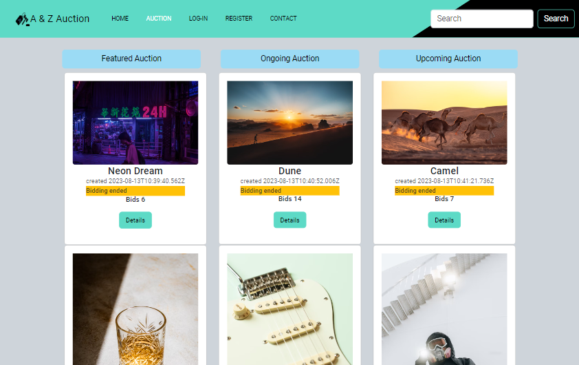

# SemesterProject-AuctionWebsite
Auction website from Noroff API

## Overview:
Welcome to A & Z Auction! Our platform enables users to browse a wide variety of items and place bids. To participate in the bidding process, users must first register and log in. Items are organized into categories based on their use, making it easy to find what you're looking for. On our homepage, you'll find featured items sorted by highest bids and ongoing auctions. Join us today and discover exciting opportunities to bid on unique items!
When a new user joins the website, they are given 1000 credits to use on the site. They can earn more credits by selling items and use credits to purchase items. Non-registered users can search through the listings, but only registered users can place bids on listin


### Badges
[](https://github.com/nyolarraklay/SemesterProject-AuctionWebsite/actions/workflows/unit-test.yml)

[](https://github.com/nyolarraklay/SemesterProject-AuctionWebsite/actions/workflows/e2e-test.yml)


### Built With


* 
* 
* 
* 
* 
* 
* [![Bootstrap][Bootstrap.com]][Bootstrap-url]


<!-- GETTING STARTED -->
## Getting Started

To get a local copy up and running follow these simple example steps.

### Prerequisites


* npm
  ```sh
  npm install 
  ```

### Installation


1. Clone the repo
   ```sh
   git clone https://github.com/nyolarraklay/SemesterProject-AuctionWebsite
   ```
2. Install NPM packages
   ```sh
   npm install
   ```
3. to use unit testing
   ```sh
   npm run test-unit
   ```

4. to use end to end testing
   ```sh
   npm run test-e2e-cli
   ```
5. if unit -test failed because it is looking for babel
  ```sh
   npm -D install @babel/core@7.19.3 @babel/preset-env@7.19.4
   ```

<!-- CONTACT -->
## Contact

Ernesto F. Osorio Jr -  - nyol_05@yahoo.com

Project Link: https://github.com/nyolarraklay/SemesterProject-AuctionWebsite


<!-- ACKNOWLEDGMENTS -->
## Acknowledgments

I would like to thank my classmates at FED 2022 FT and the Noroff teachers for their support and guidance.


<!-- MARKDOWN LINKS & IMAGES -->
[Bootstrap.com]: https://img.shields.io/badge/Bootstrap-563D7C?style=for-the-badge&logo=bootstrap&logoColor=white
[Bootstrap-url]: https://getbootstrap.com

